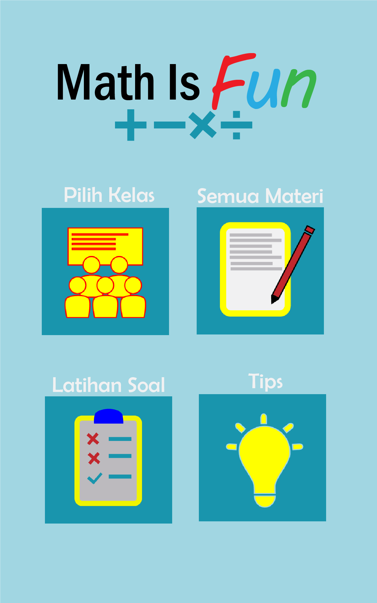
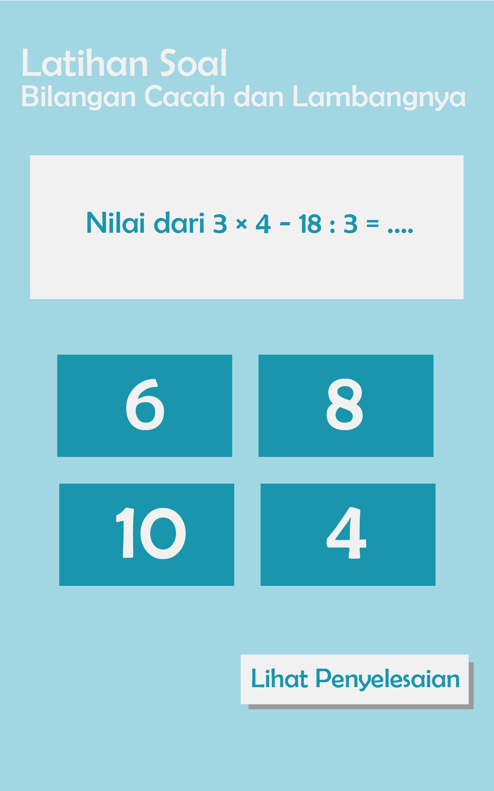
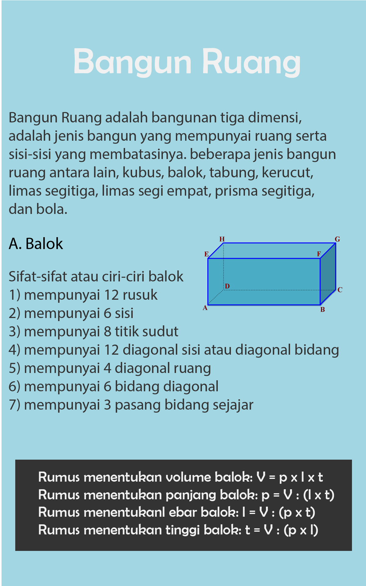

# Math Is Fun

Aplikasi Math is Fun adalah aplikasi belajar matematika untuk Sekolah Dasar. Aplikasi ini dapat digunakan oleh kalangan umum. Pada aplikasi ini, pengguna dapat membaca materi-materi matematika yang tersedia mulai dari kelas 1 sampai dengan kelas 6. Selain itu, pengguna juga dapat mengerjakan soal-soal yang tersedia untuk latihan dan dapat melihat penyelesaian soalnya. Dan juga siswa dapat membaca tips-tips yang dapat membantu belajar matematika.  

Tampilan Utama                                 | Tampilan Latihan Soal                              | Tampilan Materi
-----------------------------------------------|----------------------------------------------------|--------------------------------------------
|     |

### Link Berkas PA

(https://drive.google.com/drive/u/1/folders/1-jD23nv5-51giqdh6bHt1LKGVRR9Qywb)

### Susunan Tim

Nama                                      | Username Github | Posisi
------------------------------------------|-----------------|-----------
Adiputra Yoshua Bradonly Yudistio Langkay | YoshuaLangkay   | Mahasiswa
Nurlailiyah Salsabilah Valentina          | salsabilavalen26| Mahasiswa
Dahliar Ananda                            | dahliar         | Pembimbing
Amir Hasanudin Fauzi                      | amirhasf        | Reviewer
